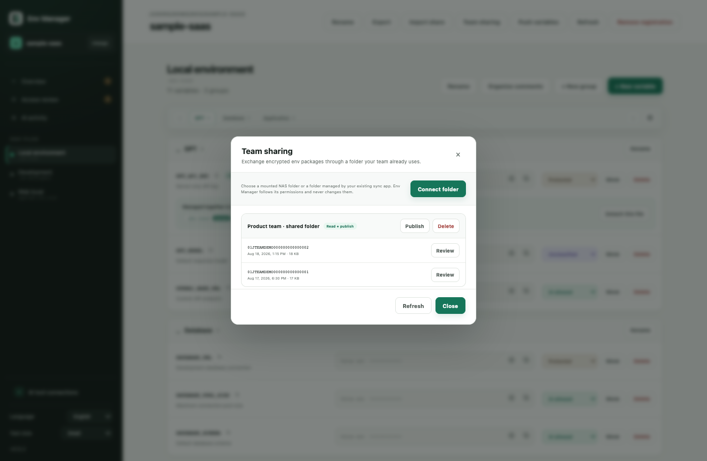
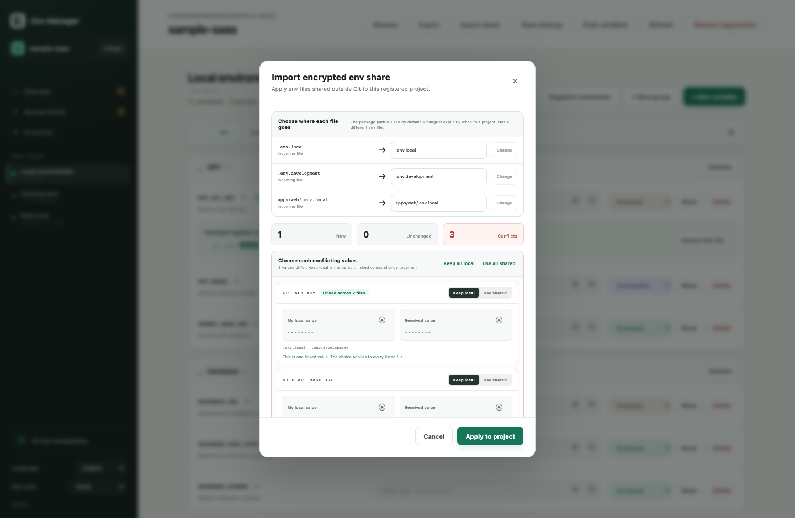
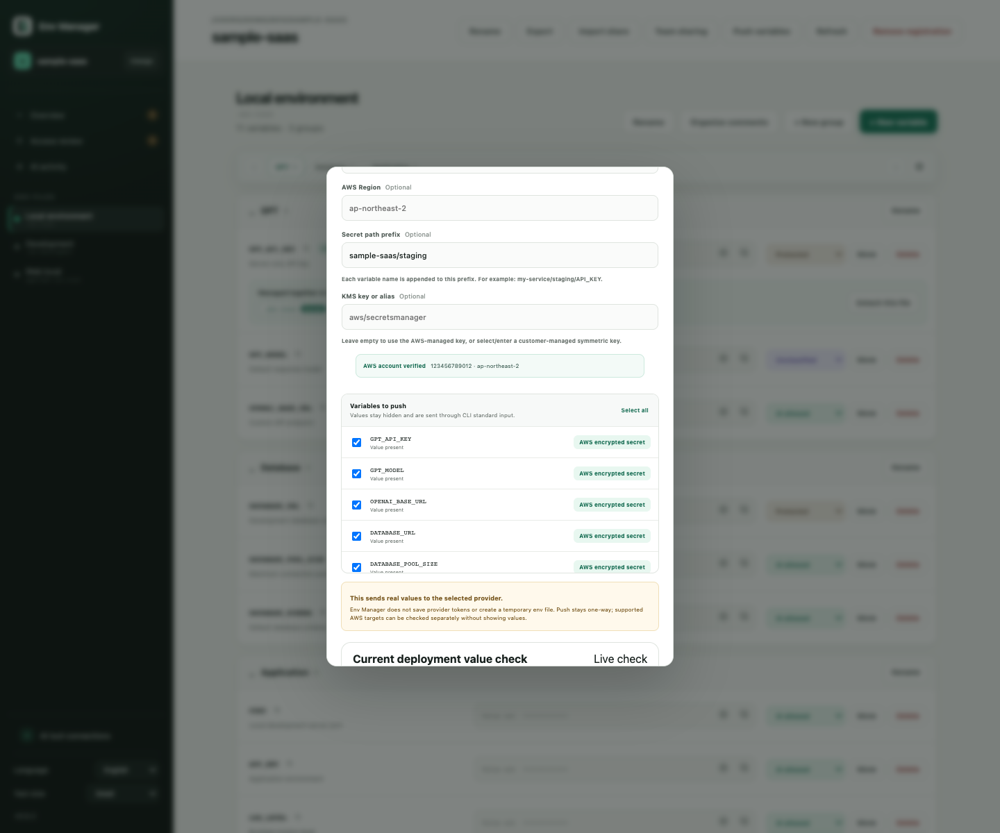
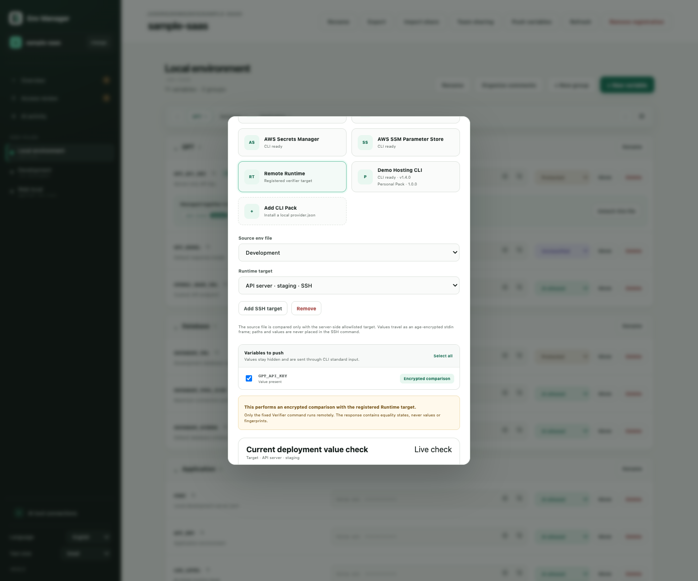
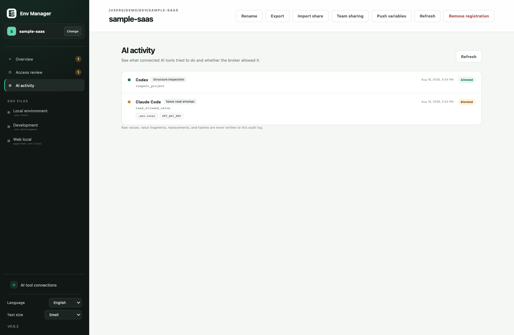

<div align="center">
  
  <h1>Env Manager</h1>
  <p><strong>프로젝트가 이미 사용하는 모든 <code>.env</code>를 한곳에서.</strong></p>
  <p>실행 방식을 바꾸거나 보호된 값을 AI 채팅에 붙여 넣지 않고 환경변수를 편집하고, 연결하고, 공유하고, 배포하세요.</p>
  <p><a href="README.md">English</a> · <a href="README.ko.md">한국어</a></p>
  <p>
    <a href="https://github.com/haechan1103/env_manager/releases/latest"></a>
    <a href="https://github.com/haechan1103/env_manager/actions/workflows/ci.yml"></a>
    <a href="LICENSE"></a>
    
    
  </p>
</div>


<div align="center">
  <a href="https://github.com/haechan1103/env_manager/releases/latest"><strong>macOS·Windows용 다운로드</strong></a>
  ·
  <a href="#ai-코딩-에이전트-연결">AI 에이전트 연결</a>
  ·
  <a href="SECURITY.md">보안 모델</a>
</div>

Env Manager는 로컬 우선 데스크톱 앱입니다. 프로젝트를 등록하면 그 프로젝트가 실제로 사용하는 `.env`, `.env.local`, `.env.development`, `runtime.env`, 하위 앱 env 파일을 찾아줍니다. 값은 원래 파일에 남으며, 계정이나 호스팅된 vault, 새로운 실행 명령을 도입하지 않습니다.

## 왜 Env Manager인가요?

| 지금 쓰는 방식을 그대로 | 연결된 값은 한 번만 수정 | AI에는 필요한 권한만 |
| --- | --- | --- |
| 기존 파일과 실행 명령이 계속 기준입니다. 경로, 주석, 순서와 관련 없는 형식을 보존합니다. | 같은 키를 2개, 3개 이상의 파일에서 명시적으로 연결합니다. 어느 파일에서 수정해도 연결된 모든 위치에 한 번에 저장합니다. | Codex, Claude Code, Copilot이 값이 제거된 로컬 Broker를 통해 구조를 확인하고 허용된 작업을 수행합니다. 보호된 값은 일반 조회 응답에 포함되지 않습니다. |
| **env 파일을 커밋하지 않고 공유** | **고른 값만 배포** | **Git 실수를 먼저 발견** |
| 전체 또는 일부 변수를 암호화 패키지로 내보내거나, 마운트한 팀 폴더에 변경 불가능한 새 패키지로 게시합니다. | 임시 env 파일을 만들지 않고 GitHub Actions, Cloudflare Workers, AWS 또는 직접 설치한 CLI Pack으로 선택한 값만 보냅니다. | 누락된 ignore 규칙, 이미 추적된 env 파일, 과거 기록과 위험한 공개 프론트엔드 변수명을 구분해 알려줍니다. |

## 0.6.2의 새로운 기능

- **Folder Team Channel:** NAS나 기존 동기화 폴더에서 암호화 패키지를 주고받고, 충돌을 확인한 뒤 프로젝트에 적용합니다.
- **AWS 배포:** Secrets Manager와 SSM `SecureString`으로 전송하고, 선택적으로 KMS 키를 지정하며, 값을 표시하지 않고 `같음` / `다름` / `없음` 상태를 확인합니다.
- **Remote Runtime 확인:** age로 암호화된 SSH Verifier를 통해 관리 파일과 서버의 허용된 대상을 비교합니다. UI에는 원격 값이나 해시가 아닌 일치 상태만 돌아옵니다.
- **Personal Provider Pack:** 앱 업데이트를 기다리지 않고 표준 입력 전용 사용자 CLI 연동을 로컬에 추가합니다.
- **AI Provider 작업:** 지원 에이전트도 데스크톱과 같은 값 비노출 Provider Engine과 값 없는 활동 기록을 사용합니다.
- **프로젝트 간 값 재사용:** 같은 이름의 보호된 값을 Rust 내부에서 다른 등록 프로젝트로 복사하며 에이전트나 일반 UI에 반환하지 않습니다.

## 실제 사용 흐름

### 복사본이 아니라 실제 env 파일을 정리합니다

프로젝트와 파일에 로컬 표시 이름을 붙여도 실제 경로는 그대로 보이고 바뀌지 않습니다. 값은 기본적으로 가려지며, 변수명 복사, 그룹 빠른 이동, 연결 파일과 저장 영향 범위를 한 화면에서 확인할 수 있습니다.


### 지금 확인해야 할 것만 모아봅니다

프로젝트 개요는 값이 비어 있는 변수, 조치가 필요한 AI 접근 검토, 파싱 경고, Git 유출 위험과 관리 파일 이동을 한곳에 모읍니다. 이 점검을 위해 값을 읽지는 않습니다.


### 전체 설정도, 팀원에게 필요한 일부만도 공유합니다

<table>
  <tr>
    <td width="50%"><strong>파일과 변수를 직접 선택</strong><br />연결된 변수는 함께 선택됩니다. 암호화 내보내기는 중간 평문 ZIP을 만들지 않습니다.</td>
    <td width="50%"><strong>팀이 이미 쓰는 폴더 활용</strong><br />마운트한 NAS나 동기화 폴더에는 암호문 패키지만 저장합니다. 기존 폴더 권한이 그대로 기준이 됩니다.</td>
  </tr>
  <tr>
    <td></td>
    <td></td>
  </tr>
</table>

가져올 때는 없는 변수만 추가하고 받는 사람에게만 있는 내용은 유지합니다. 서로 다른 값은 하나씩 선택하며 기본값은 내 값 유지입니다. 독립된 충돌은 각각 선택할 수 있고 기존 연결 그룹은 하나의 선택으로 유지됩니다.



### 필요한 값만 올리고, 확인 가능한 대상은 값 없이 비교합니다

<table>
  <tr>
    <td width="50%"><strong>Cloudflare Workers</strong><br />가장 가까운 Wrangler 설정을 찾고 로그인·계정·Worker 접근을 확인한 뒤 선택한 Worker Secret을 표준 입력으로 전송합니다.</td>
    <td width="50%"><strong>AWS Secrets Manager·SSM</strong><br />로컬 AWS Profile 또는 SSO를 사용해 계정·Region·KMS를 확인하고 실제 값을 표시하지 않은 채 일치 여부를 확인합니다.</td>
  </tr>
  <tr>
    <td></td>
    <td></td>
  </tr>
</table>

프로젝트 밖의 서버 env 파일은 관리자가 고정 Env Manager Verifier를 설치하고 대상과 변수명을 허용 목록에 넣을 수 있습니다. Env Manager는 age 암호화 stdin 프레임을 SSH로 전송하며 고정된 Verifier 명령만 실행합니다.



Provider 전송은 항상 명시적으로 시작하는 단방향 작업입니다. GitHub와 Cloudflare Secret은 다시 읽을 수 없으므로 일치한다고 추측하지 않습니다. AWS와 등록한 Runtime 대상만 별도 비교 기능으로 일치 상태를 반환합니다. 선택하지 않은 원격 항목은 삭제하지 않습니다.

## 지원하는 배포 대상

| Provider | 지원 대상 | 대상 찾기 |
| --- | --- | --- |
| GitHub Actions | 저장소 또는 배포 Environment의 Secret과 설정 Variable | 가장 가까운 Git worktree와 GitHub `origin`을 기본 감지하고, `gh`로 접근 가능한 저장소·Environment를 불러오며 Environment를 직접 생성할 수 있습니다. |
| Cloudflare Workers | 기본 Worker 또는 Wrangler 환경의 Worker Secret | 가장 가까운 `wrangler.jsonc`, `wrangler.json`, `wrangler.toml`을 찾고 현재 Wrangler 계정과 Worker 접근을 확인합니다. |
| AWS Secrets Manager | 선택 변수마다 암호화 Secret 하나 | 로컬 AWS Profile/SSO 체인을 사용하고 STS로 계정·Region을 확인하며 선택적 고객 관리형 대칭 KMS 키를 지원합니다. |
| AWS SSM Parameter Store | 선택 변수마다 `SecureString` 하나 | 같은 AWS 사전 검사를 사용하며 경로 prefix와 선택적 KMS 키를 지원합니다. |
| Remote Runtime | 허용된 서버 대상과 값 일치 여부 확인 | Git으로 공유할 수 있는 값 없는 대상 정의와 별도 설치한 고정 SSH Verifier를 사용합니다. 서버 파일을 업로드하거나 수정하지 않습니다. |
| Personal Provider Pack | 로컬 `provider.json`이 선언한 대상 | 셸 없이 선언된 실행 파일을 직접 실행하고 값은 표준 입력으로만 보냅니다. Pack은 이 컴퓨터에만 설치되고 독립적으로 제거할 수 있습니다. |

GitHub와 Cloudflare를 사용하기 전 [`gh`](https://cli.github.com/manual/gh_secret_set) 또는 [Wrangler](https://developers.cloudflare.com/workers/wrangler/commands/#secret-bulk)를 설치하고 로그인하세요. AWS는 기존 AWS SDK 자격 증명을 사용합니다. 외부 Provider Pack은 설치 전에 manifest와 실행 파일을 직접 확인해야 합니다.

## AI 코딩 에이전트 연결

독립적으로 버전 관리되는 하나의 로컬 번들이 **Codex**, **Claude Code**, **GitHub Copilot / VS Code**를 지원합니다. 앱에서 도구 감지, 설치된 번들 버전, 업데이트와 활성 보호 계층을 확인할 수 있습니다.

<table>
  <tr>
    <td width="50%"><strong>하나의 연결 화면</strong><br />도구별 감지 상태, 설치 버전, 업데이트 가능 여부와 활성 보호 방식을 확인합니다.</td>
    <td width="50%"><strong>값 없는 AI 활동 기록</strong><br />Broker 구조 확인, 값 읽기 시도, 수정, Provider 확인과 허용·차단 결과를 봅니다. 실제 값과 값 일부는 기록하지 않습니다.</td>
  </tr>
  <tr>
    <td></td>
    <td></td>
  </tr>
</table>

터미널에서 직접 설치할 수도 있습니다.

<details>
  <summary><strong>Codex</strong></summary>

```bash
codex plugin marketplace add haechan1103/env_manager
codex plugin add env-manager@env-manager
```
</details>

<details>
  <summary><strong>Claude Code</strong></summary>

```bash
claude plugin marketplace add haechan1103/env_manager
claude plugin install env-manager@env-manager
```
</details>

<details>
  <summary><strong>GitHub Copilot CLI / VS Code</strong></summary>

```bash
copilot plugin marketplace add haechan1103/env_manager
copilot plugin install env-manager@env-manager
```
</details>

먼저 Env Manager에 프로젝트를 등록하고 새 에이전트 세션에서 자연스럽게 요청하세요.

```text
이 프로젝트 env 구조를 값 없이 점검해줘.
Database 그룹을 만들고 DATABASE_URL 빈 변수를 추가해줘.
GPT_API_KEY를 local과 development에서 연결해줘.
다른 등록 프로젝트의 GEMINI_API_KEY를 값을 보여주지 말고 여기서 재사용해줘.
선택한 배포 키를 값은 보지 말고 AWS Secrets Manager의 my-service/staging 아래에 올려줘.
```

연동 도구가 프로젝트를 임의로 등록하지는 않습니다. 데스크톱 앱에 이미 등록된 프로젝트만 Broker가 허용합니다.

### AI 접근 정책

| 정책 | 에이전트 접근 |
| --- | --- |
| `protected` | 이름과 값 존재 여부만 확인하고 명시적인 값 읽기는 차단합니다. |
| `unclassified` | 정책을 정하기 전까지 `protected`와 동일하게 처리합니다. |
| `read-write` | 전용 Broker 값 도구가 명시적으로 호출될 때 값을 읽거나 수정할 수 있습니다. |

일반 구조 조회는 `read-write` 값도 반환하지 않습니다. 연결 저장, 프로젝트 간 복사, Provider 전송, 값 없는 비교 같은 Rust 내부 작업은 접근 정책을 낮추지 않습니다.

> Env Manager는 실수로 값이 노출될 가능성을 줄여주지만 운영체제 수준의 샌드박스나 운영용 Secret Manager의 대체재는 아닙니다. 값은 원래 env 파일에 남습니다. 전체 경계는 [SECURITY.md](SECURITY.md)를 확인하세요.

## 설치

[GitHub Releases](https://github.com/haechan1103/env_manager/releases/latest)에서 컴퓨터에 맞는 설치 파일을 받으세요.

- Windows 10/11 x64: `x64-setup.exe`
- Apple Silicon(M1 이상): `aarch64` DMG
- Intel Mac: `x86_64` DMG

### Windows 첫 실행

현재 Windows 설치 파일은 아직 Authenticode 서명을 사용하지 않습니다. Microsoft Defender SmartScreen이 **Windows의 PC 보호** 경고를 표시할 수 있습니다. 공식 GitHub Release에서 받은 파일임을 확인한 경우에만 **추가 정보 → 실행**을 선택하세요. 조직 관리 컴퓨터는 서명되지 않은 앱을 완전히 차단할 수도 있습니다.

### macOS 첫 실행

현재 공개 빌드는 ad-hoc 서명을 사용하며 아직 Apple 공증을 받지 않았습니다. 처음 실행할 때 macOS가 **“Env Manager.app”을 열 수 없음** 경고를 표시할 수 있습니다.

공식 GitHub Release에서 받았고 실행하려는 경우:

1. **휴지통으로 이동** 대신 **완료**를 누릅니다.
2. **시스템 설정 → 개인정보 보호 및 보안**을 엽니다.
3. **보안** 영역에서 Env Manager의 **확인 없이 열기**를 누릅니다.
4. 인증한 뒤 마지막 확인 창에서 **열기**를 누릅니다.

이 동작은 실행이 차단된 뒤 약 1시간 동안 표시됩니다. 다른 경로에서 받은 파일에는 우회 절차를 사용하지 마세요. [Apple 공식 안내](https://support.apple.com/ko-kr/guide/mac-help/mh40616/mac)를 참고하세요.

앱은 고정된 GitHub Releases 주소에서 서명된 업데이트만 확인합니다. 업데이트 확인 중 프로젝트 경로, env 메타데이터, 값이나 텔레메트리를 보내지 않습니다.

## 로컬 개발

Node.js, npm, Rust 1.85 이상과 [Tauri 2 사전 요구 사항](https://v2.tauri.app/start/prerequisites/)이 필요합니다.

```bash
git clone https://github.com/haechan1103/env_manager.git
cd env_manager
npm install
npm run tauri dev
```

PR을 열기 전 다음 명령을 확인하세요.

```bash
npm run check
cargo test --workspace
cargo clippy --workspace --all-targets -- -D warnings
```

테스트에는 합성 env fixture만 사용하세요. 실제 `.env*` 값은 커밋하거나 첨부하면 안 됩니다. 변경 전 [CONTRIBUTING.md](CONTRIBUTING.md)를 읽어주세요.

## 프로젝트 상태

Env Manager는 초기 단계의 macOS·Windows 데스크톱 프로젝트입니다. `0.6.2`는 Folder Team Channel, AWS 암호화 Secret 대상과 값 없는 비교, Remote Runtime 검증, Personal Provider Pack, 프로젝트 간 보호 값 재사용, 지원 AI 에이전트의 값 비노출 Provider 흐름을 추가합니다. Authenticode Windows 서명, macOS 공증, Windows ARM64와 더 많은 언어는 이후 작업으로 남아 있습니다.

## 커뮤니티

질문과 아이디어는 [GitHub Discussions](https://github.com/haechan1103/env_manager/discussions), 버그와 범위가 정해진 기능 요청은 [Issues](https://github.com/haechan1103/env_manager/issues)에 남겨주세요.

[Code of Conduct](CODE_OF_CONDUCT.md)를 따라주세요. 보안 문제는 [SECURITY.md](SECURITY.md)의 비공개 절차로 신고해야 합니다.

## 라이선스

[MIT](LICENSE)
