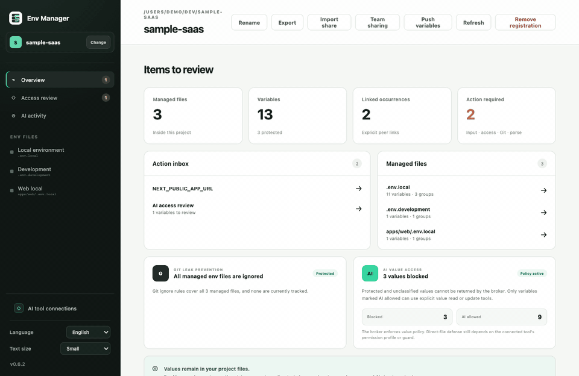
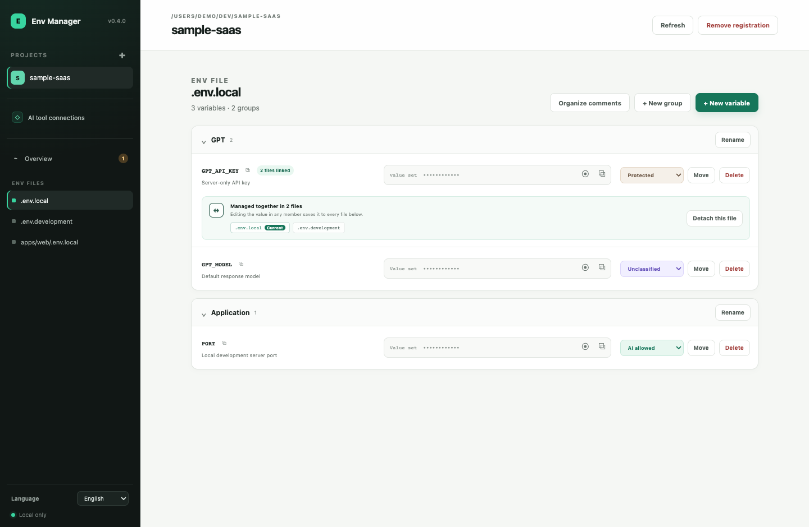
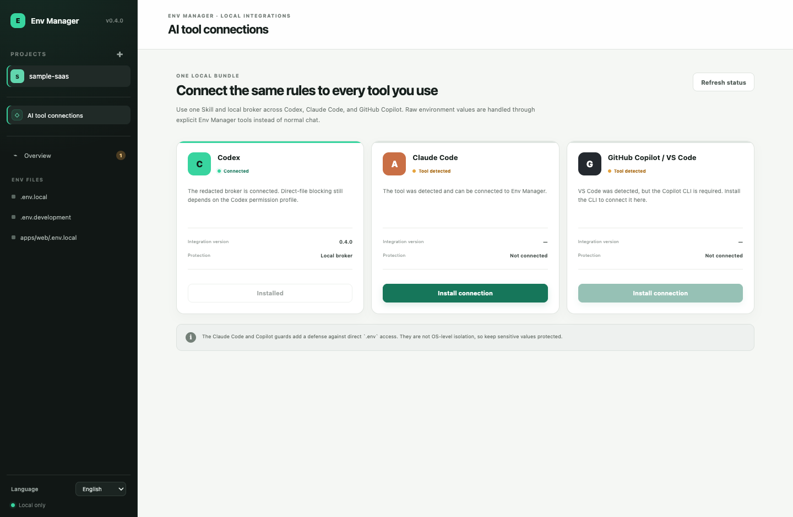

<div align="center">
  
  <h1>Env Manager</h1>
  <p><strong>Manage every <code>.env</code> file locally, while keeping protected values out of supported AI-agent workflows.</strong></p>
  <p><a href="README.md">English</a> · <a href="README.ko.md">한국어</a></p>
  <p>
    <a href="https://github.com/haechan1103/env_manager/releases/latest"></a>
    <a href="https://github.com/haechan1103/env_manager/actions/workflows/ci.yml"></a>
    <a href="LICENSE"></a>
    
  </p>
</div>



Env Manager is a local-first desktop app for the `.env` files already inside your projects. Register a project, discover its env files, edit variables in one clear UI, and explicitly link matching values across two or more files.

It is especially useful with AI coding agents: supported integrations can inspect and edit env structure through a redacted local broker without receiving values marked as protected.

<div align="center">
  <a href="https://github.com/haechan1103/env_manager/releases/latest"><strong>Download for macOS</strong></a>
  ·
  <a href="#connect-your-ai-coding-agent">Connect an AI agent</a>
  ·
  <a href="SECURITY.md">Security model</a>
</div>

## Why Env Manager?

- **One view for scattered files.** Discover `.env`, `.env.local`, `.env.development`, and nested app env files after you register a project.
- **Values stay where your app expects them.** Env Manager edits the original files; it does not migrate them into a proprietary vault.
- **Linked values update together.** Connect the same key across any number of files and edit it once.
- **Readable structure.** Manage groups, descriptions, variables, and comments without flattening the file.
- **Protected by default.** Values are masked in the UI and redacted from normal AI-tool responses.
- **Local and lightweight.** Only registered projects are scanned, and only discovered env files are watched while the app is open.
- **English by default, Korean when you want it.** Switch languages in the sidebar; the choice is saved on this device.

## Install

Download the latest DMG from [GitHub Releases](https://github.com/haechan1103/env_manager/releases/latest):

- Apple Silicon (M1 or newer): `aarch64` DMG
- Intel Mac: `x86_64` DMG

The current public build uses ad-hoc signing. If macOS blocks the first launch, Control-click Env Manager in Finder and choose **Open**. Apple Developer ID notarization and Windows support are planned.

Env Manager checks GitHub Releases for updates. It does not send project paths or environment-variable data.

## The workflow

1. Register a project folder in Env Manager.
2. Review the env files and unresolved items it discovers.
3. Add groups and descriptions, classify AI access, or link matching variables.
4. Edit once; Env Manager writes back to the original file or every explicitly linked file.

`.env.example` variants are intentionally excluded from discovery in the current release.

<details>
  <summary><strong>See the file editor and AI integration screens</strong></summary>
  <br />
  
  <br /><br />
  
</details>

## Connect your AI coding agent

The same local bundle supports **Codex**, **Claude Code**, and **GitHub Copilot / VS Code**. The desktop app can detect and install supported integrations from **AI tool connections**.

You can also install from a terminal:

<details>
  <summary><strong>Codex</strong></summary>

```bash
codex plugin marketplace add haechan1103/env_manager
codex plugin add env-manager@env-manager
```
</details>

<details>
  <summary><strong>Claude Code</strong></summary>

```bash
claude plugin marketplace add haechan1103/env_manager
claude plugin install env-manager@env-manager
```
</details>

<details>
  <summary><strong>GitHub Copilot CLI / VS Code</strong></summary>

```bash
copilot plugin marketplace add haechan1103/env_manager
copilot plugin install env-manager@env-manager
```
</details>

Register the project in Env Manager first, then start a new agent session and ask naturally:

```text
Inspect this project's env structure without reading values.
Link GPT_API_KEY across local and development.
Create a GPT group and add an empty DATABASE_URL variable.
```

The integration does not register arbitrary projects on its own. Only projects already registered in the desktop app are accepted by the broker.

## AI access policies

| Policy | Agent access |
| --- | --- |
| `protected` | Key name and value presence only; the value is blocked |
| `unclassified` | Blocked like `protected` until you choose a policy |
| `read-write` | Explicit broker value tools may read or update the value |

Normal structure inspection never returns values, including `read-write` values. A value is returned only when a dedicated value tool is called for a key already marked `read-write`.

> Env Manager is not an operating-system sandbox or a replacement for a production secret manager. Values remain in the original env files and are processed in memory when needed. See [SECURITY.md](SECURITY.md) for the complete boundary and reporting process.

## Develop locally

Requirements: Node.js, npm, Rust 1.85+, and the [Tauri 2 prerequisites](https://v2.tauri.app/start/prerequisites/).

```bash
git clone https://github.com/haechan1103/env_manager.git
cd env_manager
npm install
npm run tauri dev
```

Before opening a pull request:

```bash
npm run check
cargo test --workspace
cargo clippy --workspace --all-targets -- -D warnings
```

Use synthetic env fixtures only. Never commit or attach real `.env*` values. Read [CONTRIBUTING.md](CONTRIBUTING.md) before making a change.

## Project status

Env Manager is an early-stage macOS project. The current release is focused on reliable local file editing, guarded AI-agent integrations, and English/Korean UI support. Windows support, notarized macOS builds, and additional languages are next-stage work.

## Community

Questions and ideas belong in [GitHub Discussions](https://github.com/haechan1103/env_manager/discussions). Bugs and scoped feature requests belong in [Issues](https://github.com/haechan1103/env_manager/issues).

Please follow the [Code of Conduct](CODE_OF_CONDUCT.md). Security reports must use the private process in [SECURITY.md](SECURITY.md).

## License

[MIT](LICENSE)
