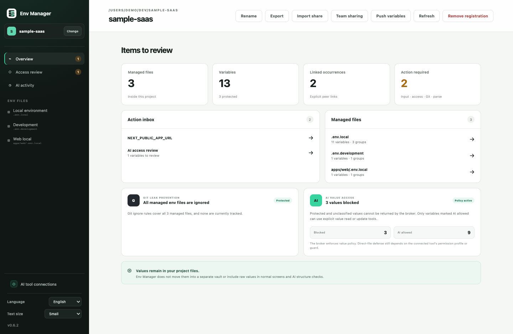
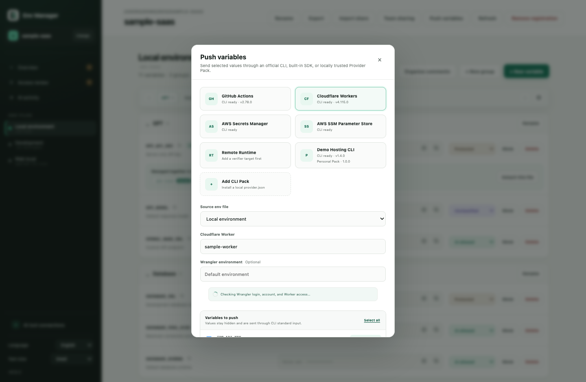
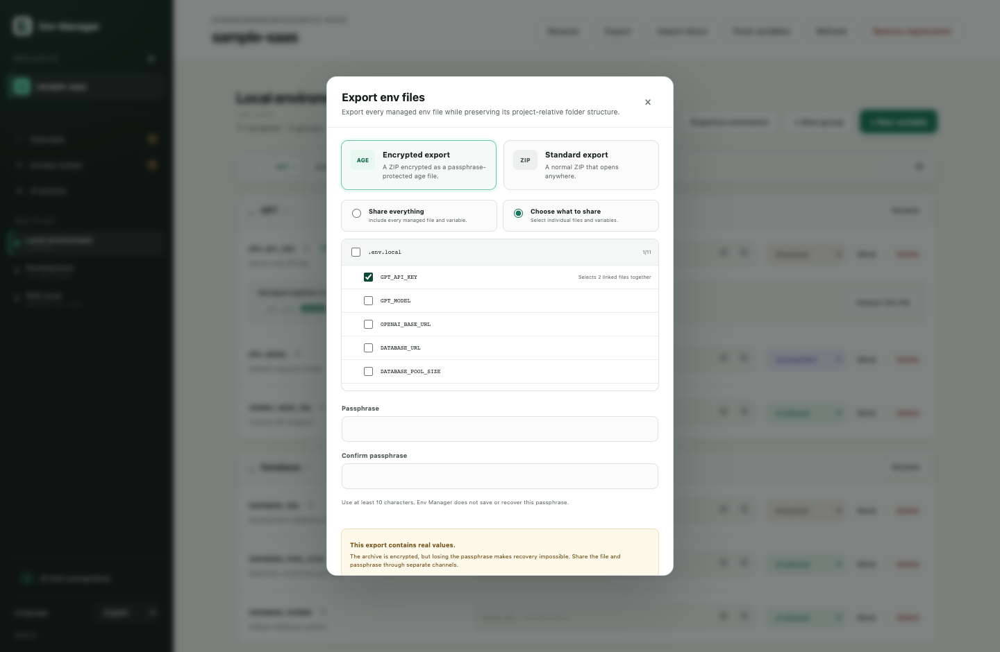

<div align="center">
  
  <h1>Env Manager</h1>
  <p><strong>Edit, link, share, and deploy the <code>.env</code> files your projects already use.</strong></p>
  <p><a href="README.md">English</a> · <a href="README.ko.md">한국어</a></p>
  <p>
    <a href="https://github.com/haechan1103/env_manager/releases/latest"></a>
    <a href="https://github.com/haechan1103/env_manager/actions/workflows/ci.yml"></a>
    <a href="LICENSE"></a>
    
    
  </p>
</div>


Env Manager is a local-first desktop app for environment variables. Register a project and manage its existing `.env`, `.env.local`, `.env.development`, and nested app env files from one UI—without changing how the project starts or moving values into a proprietary vault.

<div align="center">
  <a href="https://github.com/haechan1103/env_manager/releases/latest"><strong>Download for macOS or Windows</strong></a>
  ·
  <a href="#connect-your-ai-coding-agent">Connect an AI agent</a>
  ·
  <a href="SECURITY.md">Security model</a>
</div>

## Where it helps

| Situation | What Env Manager does |
| --- | --- |
| You are vibe-coding and an AI agent asks for API keys | Enter values in a masked desktop UI instead of pasting them into chat. The agent can still work with names, groups, and approved operations. |
| A project has `.env.local`, `.env.development`, and multiple app env files | Discover and browse them together while preserving their real paths and source formatting. |
| The same key must stay equal in two, three, or more files | Explicitly link those occurrences, then edit from any linked file and save once. |
| A teammate needs only part of your local setup | Export all or selected variables as a passphrase-encrypted `age` package, then import and merge it into the receiver's project. |
| Local values must become deployment secrets | Select only the required variables and push them to GitHub Actions or Cloudflare Workers through the official local CLI. |
| Codex, Claude Code, or Copilot needs to update env structure | Connect the shared Agent Skill and redacted broker so protected values stay outside normal inspection responses. |



## Manage local env files without replacing them

- Discover supported env files only inside projects you register.
- Edit the original files used by your existing framework and commands.
- Organize variables with groups and descriptions while preserving unrelated comments and formatting.
- Rename projects and env files with local display aliases; physical paths stay unchanged.
- Mask values by default, copy variable names, and reveal values only through an explicit short-lived action.
- Jump between groups when a file contains many variables.
- Detect missing Git ignore coverage, already tracked env files, historical paths, and suspicious public frontend variable names.
- `.env.example` variants remain intentionally excluded from discovery in the current release.


## Push selected variables to deployment providers

Env Manager can send a selected subset of one managed env file to a deployment provider. It invokes an already installed official CLI and passes values through standard input; provider tokens and temporary env files are not stored by Env Manager.

| Provider | Supported targets | Target discovery |
| --- | --- | --- |
| GitHub Actions | Repository or deployment Environment secrets and configuration variables | Detects the nearest Git worktree and GitHub `origin`, lists accessible repositories and Environments through `gh`, and can explicitly create an Environment. |
| Cloudflare Workers | Worker secrets for the default Worker or a configured Wrangler environment | Detects the nearest `wrangler.jsonc`, `wrangler.json`, or `wrangler.toml`, including Worker name and configured `env.*` names. |



This is an explicit, one-way push—not remote secret synchronization. Env Manager cannot read secret values back, compare local and remote values, or delete unselected remote entries. Install and sign in to [`gh`](https://cli.github.com/manual/gh_secret_set) or [Wrangler](https://developers.cloudflare.com/workers/wrangler/commands/#secret-bulk) first.

## Share a full setup or only selected variables

- **Standard ZIP:** portable plaintext export for trusted local handling.
- **Encrypted export:** an `age`-compatible, passphrase-protected package with no plaintext intermediate archive.
- **Full or partial scope:** share every managed file, selected files, or individual variables. Linked occurrences are selected together.
- **Safe import:** add missing variables, keep unrelated receiver content, and resolve differing local values before applying.
- The passphrase is never saved or recoverable by Env Manager. Transfer the package and passphrase through separate trusted channels.



## Connect your AI coding agent

The same independently versioned local bundle supports **Codex**, **Claude Code**, and **GitHub Copilot / VS Code**. The desktop app detects supported tools and installs their Env Manager connection from **AI tool connections**.


You can also install from a terminal:

<details>
  <summary><strong>Codex</strong></summary>

```bash
codex plugin marketplace add haechan1103/env_manager
codex plugin add env-manager@env-manager
```
</details>

<details>
  <summary><strong>Claude Code</strong></summary>

```bash
claude plugin marketplace add haechan1103/env_manager
claude plugin install env-manager@env-manager
```
</details>

<details>
  <summary><strong>GitHub Copilot CLI / VS Code</strong></summary>

```bash
copilot plugin marketplace add haechan1103/env_manager
copilot plugin install env-manager@env-manager
```
</details>

Register the project in Env Manager first, start a new agent session, and ask naturally:

```text
Inspect this project's env structure without reading values.
Create a Database group and add an empty DATABASE_URL variable.
Link GPT_API_KEY across local and development.
```

The integration never registers arbitrary projects on its own. Only projects already registered in the desktop app are accepted by the broker.

## AI access policies

| Policy | Agent access |
| --- | --- |
| `protected` | Key name and value presence only; the value is blocked |
| `unclassified` | Blocked like `protected` until you choose a policy |
| `read-write` | Explicit broker value tools may read or update the value |

Normal structure inspection never returns values, including `read-write` values. A value can be returned only when a dedicated value tool is called for a key already marked `read-write`.

> Env Manager reduces accidental exposure, but it is not an operating-system sandbox or a production secret manager. Values remain in the original env files. See [SECURITY.md](SECURITY.md) for the complete boundary.

## Install

Download the installer for your computer from [GitHub Releases](https://github.com/haechan1103/env_manager/releases/latest):

- Windows 10/11 x64: `x64-setup.exe`
- Apple Silicon (M1 or newer): `aarch64` DMG
- Intel Mac: `x86_64` DMG

### Windows first launch

The Windows installer is not yet Authenticode-signed. Microsoft Defender SmartScreen
may show **Windows protected your PC**. Proceed only if the installer came from the
official GitHub Release: choose **More info → Run anyway**. An organization-managed
computer may block unsigned applications completely. Windows code signing is planned.

### macOS first launch

The current public build uses ad-hoc signing and is not yet notarized by Apple. macOS
may therefore show **“Env Manager.app” Not Opened** on first launch even when the app
was downloaded from this repository.

If you trust the download from the official GitHub Release:

1. Choose **Done** in the warning instead of **Move to Trash**.
2. Open **System Settings → Privacy & Security**.
3. Scroll to **Security** and choose **Open Anyway** for Env Manager.
4. Authenticate when prompted, then choose **Open** in the final confirmation.

The **Open Anyway** action is available for about one hour after a blocked launch.
Do not bypass this protection for a copy obtained from any other source. See
[Apple's guidance for opening an app from an unidentified developer](https://support.apple.com/guide/mac-help/mh40616/mac).
Developer ID signing and notarization, which will remove this workaround from the
normal installation flow, are planned.

Env Manager checks the fixed GitHub Releases endpoint for signed app updates. It does not send project paths, env metadata, or values during an update check.

## Develop locally

Requirements: Node.js, npm, Rust 1.85+, and the [Tauri 2 prerequisites](https://v2.tauri.app/start/prerequisites/).

```bash
git clone https://github.com/haechan1103/env_manager.git
cd env_manager
npm install
npm run tauri dev
```

Before opening a pull request:

```bash
npm run check
cargo test --workspace
cargo clippy --workspace --all-targets -- -D warnings
```

Use synthetic env fixtures only. Never commit or attach real `.env*` values. Read [CONTRIBUTING.md](CONTRIBUTING.md) before making a change.

## Project status

Env Manager is an early-stage macOS and Windows desktop project. Version `0.6.1` adds four persistent text-size levels while retaining the Windows 10/11 x64 installer, local file editing, linked values, encrypted handoff, provider push, guarded AI-agent integrations, and English/Korean UI support. Authenticode-signed Windows builds, notarized macOS builds, Windows ARM64, and additional languages remain next-stage work.

## Community

Questions and ideas belong in [GitHub Discussions](https://github.com/haechan1103/env_manager/discussions). Bugs and scoped feature requests belong in [Issues](https://github.com/haechan1103/env_manager/issues).

Please follow the [Code of Conduct](CODE_OF_CONDUCT.md). Security reports must use the private process in [SECURITY.md](SECURITY.md).

## License

[MIT](LICENSE)
